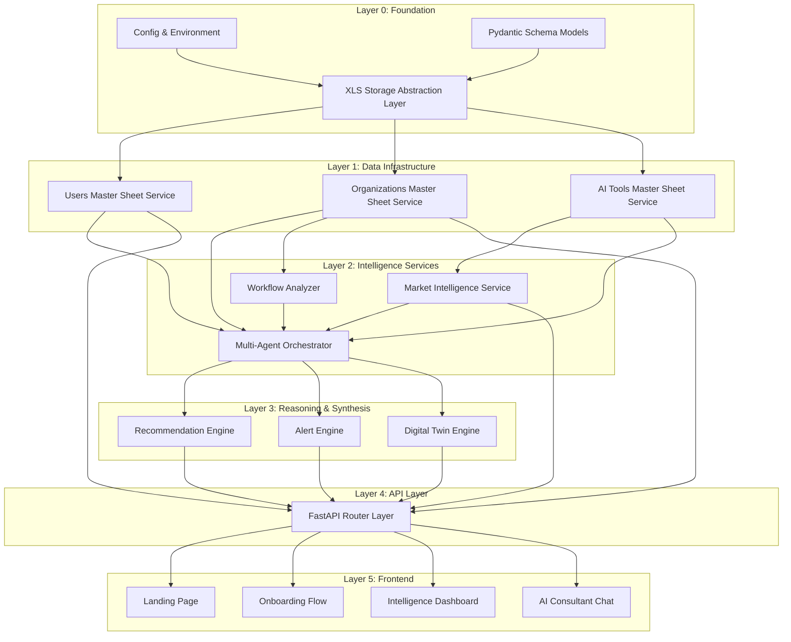
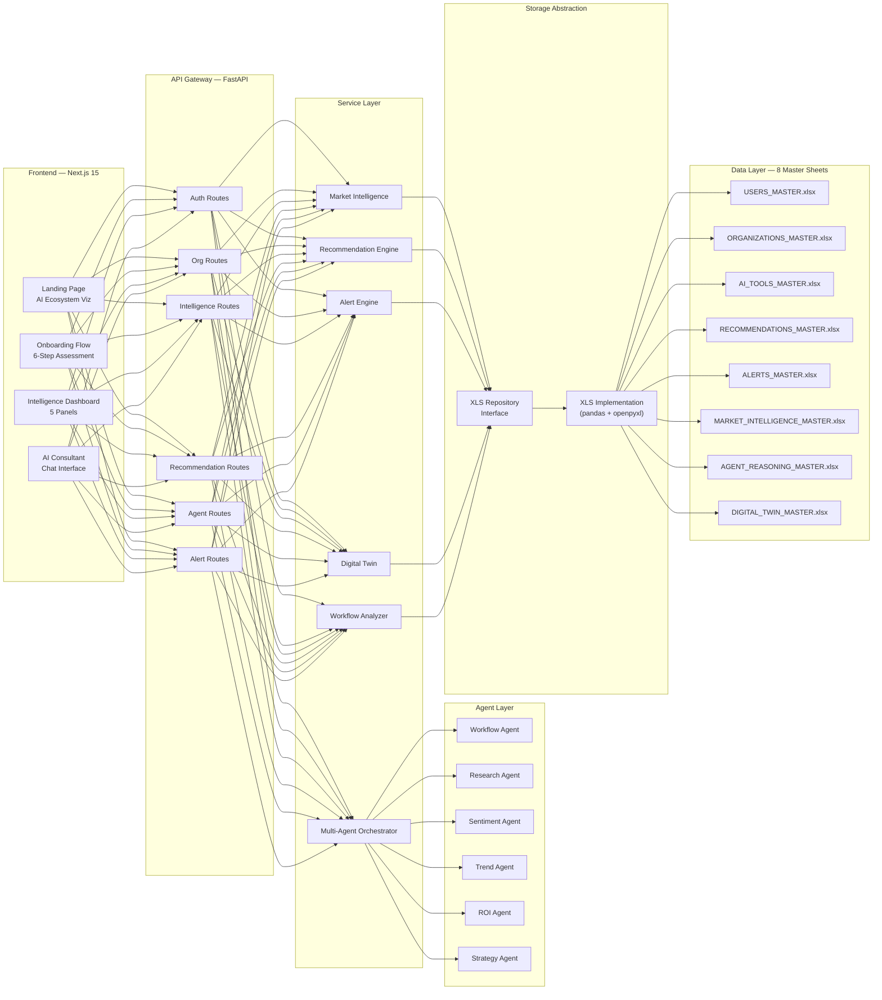
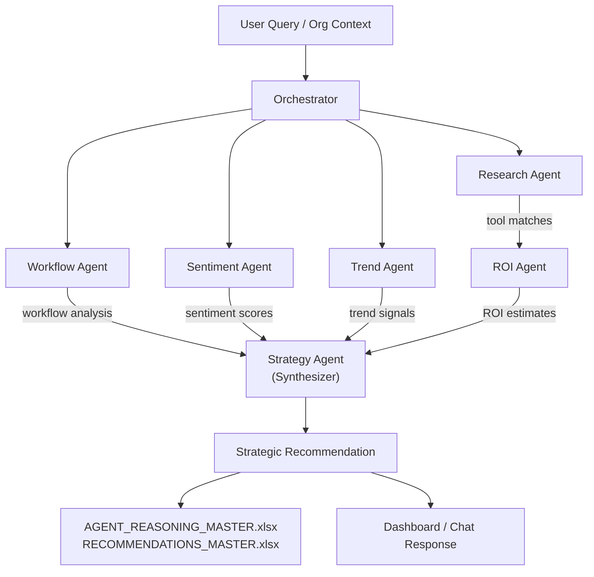
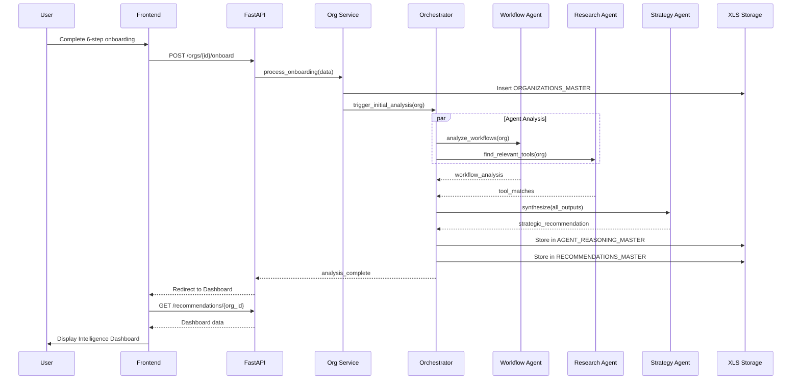
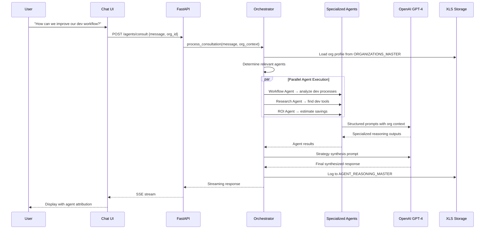

# AdaptiveAI — Master Implementation Plan

> An Adaptive AI-Native Operational Intelligence Platform

## Document Analysis Summary

All 7 master architecture documents have been deeply analyzed and cross-referenced:

| Document | Key Extractions |
|---|---|
| [01_Master_PRD.docx](file:///m:/Bytehearts/01_Master_PRD.docx) | Product vision, 6 core system modules, 3-tier feature classification, target users, success metrics |
| [02_Master_TRD.docx](file:///m:/Bytehearts/02_Master_TRD.docx) | Tech stack (Next.js 15 + FastAPI), 5 microservices, 6 specialized agents, data flow architecture |
| [03_Master_App_Flow.docx](file:///m:/Bytehearts/03_Master_App_Flow.docx) | 7-step primary user flow, 6-step onboarding, 5 dashboard modules, edge cases |
| [04_Master_UI_UX.docx](file:///m:/Bytehearts/04_Master_UI_UX.docx) | Dark-mode-first design system, color palette (#7C3AED / #09090B / #00E5A8), 6 core UI components |
| [05_Updated_Backend_Schema.docx](file:///m:/Bytehearts/05_Updated_Backend_Schema_XLS_Architecture.docx) | 8 master XLS sheets with schemas, data operations, file storage structure, migration strategy |
| [06_Master_Implementation_Plan.docx](file:///m:/Bytehearts/06_Master_Implementation_Plan.docx) | 10-phase roadmap from initialization to production deployment |
| [07_Conversation_Intelligence.docx](file:///m:/Bytehearts/07_Conversation_Intelligence_and_Ideology.docx) | Evolution philosophy (finder → engine → intelligence → platform), product positioning, hackathon strategy |

---

## Architectural Truth — System Dependency Map

Before building anything, we must understand how every system depends on every other system. The following dependency graph governs our build order:



---

## System Architecture Overview



---

## Monorepo Structure

```
m:\Bytehearts\adaptiveai\
├── frontend/                          # Next.js 15 application
│   ├── src/
│   │   ├── app/                       # App Router pages
│   │   │   ├── (landing)/             # Landing page group
│   │   │   ├── (auth)/                # Auth pages group
│   │   │   ├── onboarding/            # 6-step onboarding flow
│   │   │   ├── dashboard/             # Intelligence dashboard
│   │   │   │   ├── intelligence/      # Org intelligence panel
│   │   │   │   ├── market/            # Market intelligence panel
│   │   │   │   ├── stack/             # AI stack recommendation panel
│   │   │   │   ├── alerts/            # Alert center
│   │   │   │   ├── roi/               # ROI analytics
│   │   │   │   └── twin/             # Digital twin view
│   │   │   └── consultant/            # AI consultant chat
│   │   ├── components/
│   │   │   ├── ui/                    # shadcn/ui base components
│   │   │   ├── dashboard/             # Dashboard-specific components
│   │   │   ├── visualizations/        # Graphs, heatmaps, network viz
│   │   │   ├── onboarding/            # Onboarding step components
│   │   │   └── landing/              # Landing page sections
│   │   ├── lib/
│   │   │   ├── api/                   # API client functions
│   │   │   ├── stores/                # Zustand state stores
│   │   │   └── utils/                 # Shared utilities
│   │   └── styles/                    # Global styles & design tokens
│   ├── public/                        # Static assets
│   ├── next.config.ts
│   ├── tailwind.config.ts
│   ├── tsconfig.json
│   └── package.json
│
├── backend/                           # FastAPI application
│   ├── app/
│   │   ├── main.py                    # FastAPI app entry point
│   │   ├── config.py                  # Settings & environment
│   │   ├── api/
│   │   │   ├── v1/
│   │   │   │   ├── routes/
│   │   │   │   │   ├── auth.py
│   │   │   │   │   ├── organizations.py
│   │   │   │   │   ├── intelligence.py
│   │   │   │   │   ├── recommendations.py
│   │   │   │   │   ├── agents.py
│   │   │   │   │   ├── alerts.py
│   │   │   │   │   └── market.py
│   │   │   │   └── router.py          # v1 router aggregator
│   │   │   └── deps.py                # Shared dependencies
│   │   ├── schemas/                   # Pydantic models
│   │   │   ├── user.py
│   │   │   ├── organization.py
│   │   │   ├── ai_tool.py
│   │   │   ├── recommendation.py
│   │   │   ├── alert.py
│   │   │   ├── market_intelligence.py
│   │   │   ├── agent_reasoning.py
│   │   │   └── digital_twin.py
│   │   ├── services/                  # Business logic layer
│   │   │   ├── auth_service.py
│   │   │   ├── organization_service.py
│   │   │   ├── ai_tool_service.py
│   │   │   ├── recommendation_service.py
│   │   │   ├── alert_service.py
│   │   │   ├── market_intelligence_service.py
│   │   │   └── digital_twin_service.py
│   │   ├── agents/                    # Multi-agent system
│   │   │   ├── orchestrator.py        # Central orchestration
│   │   │   ├── base_agent.py          # Abstract agent class
│   │   │   ├── workflow_agent.py
│   │   │   ├── research_agent.py
│   │   │   ├── sentiment_agent.py
│   │   │   ├── trend_agent.py
│   │   │   ├── roi_agent.py
│   │   │   └── strategy_agent.py
│   │   ├── intelligence/              # Intelligence engines
│   │   │   ├── market_engine.py
│   │   │   ├── evolution_engine.py
│   │   │   ├── obsolescence_detector.py
│   │   │   └── trust_index.py
│   │   ├── storage/                   # Storage abstraction layer
│   │   │   ├── base_repository.py     # Abstract repository interface
│   │   │   ├── xls_repository.py      # XLS implementation
│   │   │   └── sheet_manager.py       # Sheet lifecycle management
│   │   └── core/                      # Shared core utilities
│   │       ├── ai_client.py           # OpenAI/Claude/Gemini client
│   │       ├── exceptions.py
│   │       └── logging.py
│   ├── data/                          # XLS master sheets directory
│   │   ├── USERS_MASTER.xlsx
│   │   ├── ORGANIZATIONS_MASTER.xlsx
│   │   ├── AI_TOOLS_MASTER.xlsx
│   │   ├── RECOMMENDATIONS_MASTER.xlsx
│   │   ├── ALERTS_MASTER.xlsx
│   │   ├── MARKET_INTELLIGENCE_MASTER.xlsx
│   │   ├── AGENT_REASONING_MASTER.xlsx
│   │   └── DIGITAL_TWIN_MASTER.xlsx
│   ├── requirements.txt
│   ├── .env.example
│   └── pyproject.toml
│
├── docs/                              # Architecture documents (originals)
└── README.md
```

---

## User Review Required

> [!IMPORTANT]
> **Tech stack confirmation**: The TRD specifies Next.js 15 + Tailwind CSS + shadcn/ui for frontend and FastAPI + Python for backend. The schema document specifies XLS architecture (not PostgreSQL initially). **Confirming: we build with XLS storage first, with abstraction layer ready for future PostgreSQL migration.** Please confirm this is the correct path.

> [!IMPORTANT]
> **AI API Key requirement**: The multi-agent system requires at minimum an OpenAI API key (GPT-4.1 / GPT-4o). Do you have an API key ready, or should I build the agents with mock/simulated reasoning for initial development and demo?

> [!WARNING]
> **Scope vs. Hackathon timeline**: The full architecture describes 10 phases. For a hackathon-viable MVP, I propose building Phases 1–8 with core functionality, deferring Phase 9 (full alert engine) and Phase 10 (production deployment) to post-hackathon. The alert center will still exist in the UI with pre-seeded demo data.

---

## Open Questions

> [!IMPORTANT]
> **Authentication approach**: The TRD mentions Clerk Authentication + OAuth + JWT. For hackathon speed, should I implement full Clerk integration, or a simpler JWT-based auth with email/password that can be swapped for Clerk later?

> [!IMPORTANT]
> **Market Intelligence APIs**: Reddit, GitHub, Product Hunt, NewsAPI, and Hacker News are listed. Do you have API keys for any of these? If not, I'll build the market intelligence service with intelligent mock data that simulates real market signals, with the API integration hooks ready for production.

> [!IMPORTANT]
> **Deployment target**: Where do you plan to deploy? Vercel (frontend) + Railway/Render (backend)? Or local-only for hackathon demo?

---

## Proposed Changes — Phase-by-Phase Build Strategy

### Phase 1: Foundation Layer (Config, Storage Abstraction, Schemas)

**Why this is first**: Every system in AdaptiveAI reads/writes data. Without the storage abstraction layer, nothing else can function. This is the bedrock.

---

#### [NEW] [config.py](file:///m:/Bytehearts/adaptiveai/backend/app/config.py)
- Centralized settings using Pydantic `BaseSettings`
- All file paths, API keys, and environment variables abstracted
- Never hardcoded — all configurable via `.env`
- Migration-ready: a single `STORAGE_BACKEND` flag switches XLS → PostgreSQL

#### [NEW] [base_repository.py](file:///m:/Bytehearts/adaptiveai/backend/app/storage/base_repository.py)
- Abstract `Repository` interface defining all CRUD operations:
  - `insert(record)` → creates a row
  - `find_by_id(id)` → retrieves by primary key
  - `find_all(filters)` → query with intelligent filtering
  - `update(id, data)` → updates specific fields
  - `delete(id)` → soft/hard delete
  - `aggregate(column, operation)` → trend aggregation
- This interface is **storage-agnostic** — implementations can be XLS or SQL

#### [NEW] [xls_repository.py](file:///m:/Bytehearts/adaptiveai/backend/app/storage/xls_repository.py)
- Concrete implementation using pandas + openpyxl
- Thread-safe file locking for concurrent access
- Auto-creates sheets with correct schemas if they don't exist
- Supports: row insertion, updates, filtering, semantic matching
- Batch operations for performance

#### [NEW] [sheet_manager.py](file:///m:/Bytehearts/adaptiveai/backend/app/storage/sheet_manager.py)
- Manages sheet lifecycle: creation, schema validation, backup
- Initializes all 8 master sheets with correct column headers on first run
- Provides health-check endpoints for data integrity

#### [NEW] All 8 Pydantic schema files in `backend/app/schemas/`
- Strict typed models matching every master sheet schema from Doc 05
- Validation rules, defaults, auto-generated IDs, timestamps
- Serialization/deserialization for XLS ↔ API responses

---

### Phase 2: Core Backend Services

**Why second**: Services encapsulate business logic above the storage layer. Routes delegate to services, services delegate to repositories.

---

#### [NEW] [organization_service.py](file:///m:/Bytehearts/adaptiveai/backend/app/services/organization_service.py)
- Organization CRUD operations
- AI maturity score calculation
- Workflow mapping and analysis coordination
- Pain point categorization

#### [NEW] [ai_tool_service.py](file:///m:/Bytehearts/adaptiveai/backend/app/services/ai_tool_service.py)
- AI tool catalog management
- Trust score computation
- Future-proof scoring algorithm
- Compatibility tag matching
- Category-based and workflow-based querying

#### [NEW] [auth_service.py](file:///m:/Bytehearts/adaptiveai/backend/app/services/auth_service.py)
- User registration and authentication
- JWT token generation and validation
- Session management
- Organization membership linkage

#### [NEW] [market_intelligence_service.py](file:///m:/Bytehearts/adaptiveai/backend/app/services/market_intelligence_service.py)
- Aggregates data from market intelligence sources
- Computes trend velocity, sentiment scores, community mentions
- Stores processed intelligence in MARKET_INTELLIGENCE_MASTER.xlsx

---

### Phase 3: Multi-Agent Reasoning System

**Why third**: The agents are the brain of AdaptiveAI. They depend on services (Phase 2) and storage (Phase 1). Every recommendation, alert, and insight flows through agent reasoning.

**Architecture philosophy**: These are NOT autonomous AI agents. They are **specialized orchestrated reasoning modules** — structured prompt pipelines with defined inputs, processing, and outputs.

---

#### [NEW] [base_agent.py](file:///m:/Bytehearts/adaptiveai/backend/app/agents/base_agent.py)
- Abstract base class for all agents
- Defines: `analyze(context) → AgentOutput`
- Standardized input/output schemas
- Retry logic, error handling, token management

#### [NEW] [workflow_agent.py](file:///m:/Bytehearts/adaptiveai/backend/app/agents/workflow_agent.py)
- **Input**: Organization workflows, team structure, pain points
- **Reasoning**: Identifies bottlenecks, repetitive tasks, automation opportunities
- **Output**: Workflow analysis report with scored optimization points

#### [NEW] [research_agent.py](file:///m:/Bytehearts/adaptiveai/backend/app/agents/research_agent.py)
- **Input**: Organization needs, current AI tools, workflow gaps
- **Reasoning**: Searches AI_TOOLS_MASTER for relevant matches, scores compatibility
- **Output**: Ranked tool suggestions with reasoning

#### [NEW] [sentiment_agent.py](file:///m:/Bytehearts/adaptiveai/backend/app/agents/sentiment_agent.py)
- **Input**: Tool names, market intelligence data
- **Reasoning**: Analyzes Reddit sentiment, community trust, developer satisfaction
- **Output**: Sentiment scores and risk flags per tool

#### [NEW] [trend_agent.py](file:///m:/Bytehearts/adaptiveai/backend/app/agents/trend_agent.py)
- **Input**: Market intelligence, tool growth metrics
- **Reasoning**: Tracks ecosystem evolution, identifies emerging categories
- **Output**: Trend velocity scores, emerging tool flags

#### [NEW] [roi_agent.py](file:///m:/Bytehearts/adaptiveai/backend/app/agents/roi_agent.py)
- **Input**: Tool pricing, organization size, workflow data
- **Reasoning**: Calculates expected ROI, cost savings, productivity gains
- **Output**: ROI estimation per tool/stack with confidence levels

#### [NEW] [strategy_agent.py](file:///m:/Bytehearts/adaptiveai/backend/app/agents/strategy_agent.py)
- **Input**: All other agent outputs
- **Reasoning**: Synthesizes a unified organizational AI strategy
- **Output**: Final strategic recommendation with rationale

#### [NEW] [orchestrator.py](file:///m:/Bytehearts/adaptiveai/backend/app/agents/orchestrator.py)
- Central coordination engine
- Determines which agents to invoke based on query type
- Manages agent execution order (parallel where possible, sequential for dependencies)
- Combines agent outputs into synthesized response
- Stores reasoning chain in AGENT_REASONING_MASTER.xlsx

**Agent Data Flow:**



---

### Phase 4: Intelligence Engines

**Why fourth**: These engines build on top of agent outputs and market data to provide higher-order intelligence features.

---

#### [NEW] [market_engine.py](file:///m:/Bytehearts/adaptiveai/backend/app/intelligence/market_engine.py)
- Processes raw market data into actionable intelligence
- Generates AI market heatmaps
- Tracks ecosystem movement and category evolution

#### [NEW] [evolution_engine.py](file:///m:/Bytehearts/adaptiveai/backend/app/intelligence/evolution_engine.py)
- Predicts future AI needs based on organization trajectory
- Identifies emerging AI categories relevant to the org
- Generates organizational AI roadmaps

#### [NEW] [obsolescence_detector.py](file:///m:/Bytehearts/adaptiveai/backend/app/intelligence/obsolescence_detector.py)
- Monitors org's current AI stack against market signals
- Detects declining tools (shrinking GitHub stars, negative sentiment, funding drops)
- Triggers replacement alerts

#### [NEW] [trust_index.py](file:///m:/Bytehearts/adaptiveai/backend/app/intelligence/trust_index.py)
- Composite trust scoring algorithm
- Factors: community sentiment, GitHub activity, security score, API reliability, funding stability
- Generates AI Trust Index for every tool

---

### Phase 5: API Routes Layer

**Why fifth**: Routes are thin controllers that wire HTTP endpoints to services and agents. They depend on everything below.

---

#### [NEW] All route files in `backend/app/api/v1/routes/`

| Route File | Endpoints | Purpose |
|---|---|---|
| `auth.py` | `POST /signup`, `POST /login`, `GET /me` | User authentication |
| `organizations.py` | `POST /orgs`, `GET /orgs/{id}`, `PUT /orgs/{id}`, `POST /orgs/{id}/onboard` | Organization CRUD + onboarding |
| `intelligence.py` | `GET /intelligence/market`, `GET /intelligence/trends`, `GET /intelligence/heatmap` | Market intelligence endpoints |
| `recommendations.py` | `POST /recommendations/generate`, `GET /recommendations/{org_id}`, `GET /recommendations/{id}/reasoning` | AI stack recommendations |
| `agents.py` | `POST /agents/consult`, `POST /agents/analyze-workflow`, `GET /agents/reasoning/{id}` | Multi-agent interaction |
| `alerts.py` | `GET /alerts/{org_id}`, `PUT /alerts/{id}/dismiss` | Alert management |
| `market.py` | `GET /market/tools`, `GET /market/tools/{id}`, `GET /market/categories` | AI tool catalog |

#### [NEW] [main.py](file:///m:/Bytehearts/adaptiveai/backend/app/main.py)
- FastAPI application initialization
- CORS configuration for Next.js frontend
- Middleware: logging, error handling, request tracing
- Startup: initialize XLS sheets, validate data integrity
- v1 router mounting

---

### Phase 6: Frontend Foundation

**Why sixth**: The frontend depends on a working API. We build the design system, then the pages.

---

#### [NEW] Next.js 15 project initialization
- App Router architecture
- TypeScript strict mode
- Tailwind CSS with custom design tokens from Doc 04
- shadcn/ui component library
- Framer Motion for animations
- Zustand for state management
- React Query for data fetching

#### [NEW] Design System (`styles/globals.css` + `tailwind.config.ts`)
- **Colors**: Primary `#7C3AED`, Background `#09090B`, Accent `#00E5A8`
- **Typography**: Inter (body) + Geist Mono (data/code)
- **Dark-mode-first** aesthetic — Bloomberg Terminal inspired
- Glassmorphism panels, subtle gradients, glow effects
- Custom animation classes for intelligence animations

#### [NEW] Core UI Components
- Intelligence cards with glow borders
- Data visualization containers
- Agent reasoning display panels
- Score gauges (trust, maturity, future-proof)
- Terminal-style data feeds
- Network graph containers

---

### Phase 7: Frontend Pages & Features

---

#### [NEW] Landing Page (`app/(landing)/page.tsx`)
- Hero: "The Intelligence Layer Above the AI Ecosystem"
- Live AI market pulse visualization (animated)
- Organizational AI evolution showcase
- Interactive AI ecosystem map
- CTA → Onboarding

#### [NEW] Onboarding Flow (`app/onboarding/`)
- **Step 1**: Organization details (name, type, size)
- **Step 2**: Workflow analysis (departments, processes)
- **Step 3**: Current AI tools (what they use today)
- **Step 4**: Pain point analysis (bottlenecks, frustrations)
- **Step 5**: Operational goals (automation targets)
- **Step 6**: AI maturity assessment (scored)
- Each step feeds the organizational profile → triggers agent analysis

#### [NEW] Intelligence Dashboard (`app/dashboard/`)
5 core panels as defined in Doc 03:

1. **Organizational Intelligence Panel**: AI maturity score gauge, workflow bottleneck map, operational insights feed
2. **AI Market Intelligence Panel**: Trending tools, ecosystem movement heatmap, market velocity chart
3. **AI Stack Recommendation Panel**: Recommended ecosystem with compatibility graph, workflow-specific stacks
4. **Alert Center**: Obsolete tool warnings, emerging tool notifications, replacement opportunities
5. **ROI Analytics**: Productivity estimation charts, cost reduction projections, automation opportunity scores

#### [NEW] AI Consultant Chat (`app/consultant/`)
- Full chat interface connecting to multi-agent orchestrator
- Streaming responses with agent reasoning transparency
- Shows which agents contributed to the response
- Contextual follow-ups based on organization profile

#### [NEW] Digital Twin View (`app/dashboard/twin/`)
- Visual representation of organization's AI infrastructure
- Workflow node map with AI tool assignments
- Bottleneck highlights
- Optimization prediction overlays

---

### Phase 8: Integration, Seeding & Polish

---

#### Data seeding
- Pre-populate AI_TOOLS_MASTER.xlsx with 50+ real AI tools across categories:
  - Development (Cursor, GitHub Copilot, Replit)
  - Design (Figma AI, Midjourney, DALL-E)
  - Communication (Notion AI, Slack AI, Otter)
  - Analytics (Tableau, Mixpanel)
  - Marketing (Jasper, Copy.ai)
  - Operations (Zapier, Make)
  - Customer Support (Intercom, Zendesk AI)
- Each tool with realistic scores, pricing, compatibility tags

#### Market Intelligence seeding
- Pre-populate MARKET_INTELLIGENCE_MASTER.xlsx with realistic market data
- Simulated Reddit sentiment, GitHub growth, Product Hunt rankings

#### End-to-end integration testing
- Full onboarding → dashboard flow
- Agent reasoning chain verification
- Recommendation generation validation

#### UI polish
- Loading states with intelligence animations
- Error boundaries
- Responsive layouts for all screen sizes
- Performance optimization

---

## Data Flow Diagrams

### Onboarding → Dashboard Flow



### AI Consultant Chat Flow



---

## XLS Storage Abstraction — Design Detail

The storage layer is designed for **zero-friction PostgreSQL migration**:

```python
# base_repository.py — The interface all storage backends implement
class BaseRepository(ABC):
    @abstractmethod
    async def insert(self, record: BaseModel) -> str: ...
    
    @abstractmethod
    async def find_by_id(self, id: str) -> Optional[dict]: ...
    
    @abstractmethod
    async def find_all(self, filters: dict = None, 
                       sort_by: str = None,
                       limit: int = None) -> List[dict]: ...
    
    @abstractmethod
    async def update(self, id: str, data: dict) -> bool: ...
    
    @abstractmethod
    async def delete(self, id: str) -> bool: ...
    
    @abstractmethod
    async def aggregate(self, column: str, 
                        operation: str) -> Any: ...

# xls_repository.py — Current implementation
class XLSRepository(BaseRepository):
    """Implements BaseRepository using pandas DataFrames 
    backed by .xlsx files via openpyxl."""
    
    def __init__(self, sheet_name: str, schema: Type[BaseModel]):
        self.sheet_path = settings.data_dir / f"{sheet_name}.xlsx"
        self.schema = schema
    
    # All CRUD operations use pandas for in-memory ops
    # and openpyxl for persistence

# FUTURE: sql_repository.py — Drop-in replacement
# class SQLRepository(BaseRepository):
#     """Implements BaseRepository using SQLAlchemy + PostgreSQL"""
```

**Migration path**: When ready for PostgreSQL, create `SQLRepository(BaseRepository)`, change `STORAGE_BACKEND=sql` in config, and all services continue working with zero code changes.

---

## Verification Plan

### Automated Tests
- **Backend unit tests**: Each service and repository method
- **API integration tests**: Full endpoint testing with httpx/TestClient
- **Agent output validation**: Structured output schema verification
- **XLS read/write tests**: Data integrity after CRUD operations

### Manual Verification
- Complete onboarding flow end-to-end in browser
- Verify all 5 dashboard panels render with data
- Test AI consultant chat with varied queries
- Verify XLS files are correctly populated after operations
- Test responsive layout on mobile viewport
- Verify dark mode renders correctly across all pages

### Build & Run Verification
```bash
# Backend
cd backend && pip install -r requirements.txt
uvicorn app.main:app --reload --port 8000

# Frontend
cd frontend && npm install
npm run dev  # → http://localhost:3000

# Verify API
curl http://localhost:8000/docs  # OpenAPI docs should load
```

---

## Implementation Timeline Estimate

| Phase | Description | Estimated Effort |
|---|---|---|
| Phase 1 | Foundation (Config, Storage, Schemas) | Core infrastructure |
| Phase 2 | Backend Services | Business logic layer |
| Phase 3 | Multi-Agent System | AI reasoning engine |
| Phase 4 | Intelligence Engines | Advanced analytics |
| Phase 5 | API Routes | HTTP interface |
| Phase 6 | Frontend Foundation | Design system + scaffold |
| Phase 7 | Frontend Pages | All views and interactions |
| Phase 8 | Integration & Polish | End-to-end testing |

Each phase builds directly on the previous one. No phase can be skipped without breaking downstream dependencies.

---

## Key Architectural Decisions

| Decision | Rationale |
|---|---|
| **Repository pattern** for storage | Enables XLS → PostgreSQL migration with zero service-layer changes |
| **Service layer** between routes and storage | Clean separation of concerns; routes stay thin |
| **Orchestrated agents**, not autonomous | Predictable, debuggable, cost-controlled AI reasoning |
| **Monorepo** structure | Shared types, coordinated deploys, single source of truth |
| **Dark-mode-first** UI | Matches the "Bloomberg Terminal for AI" design vision |
| **Pre-seeded data** | Demo-ready without requiring live API keys |
| **SSE streaming** for chat | Real-time agent reasoning display |
| **Pydantic schemas** shared across storage + API | Single type definition, consistent validation |
